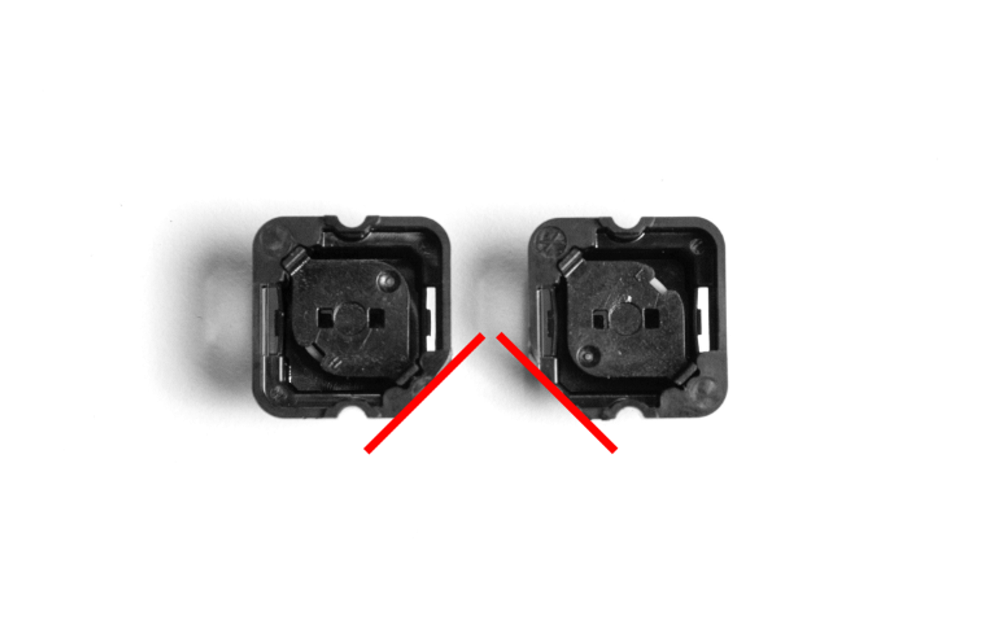
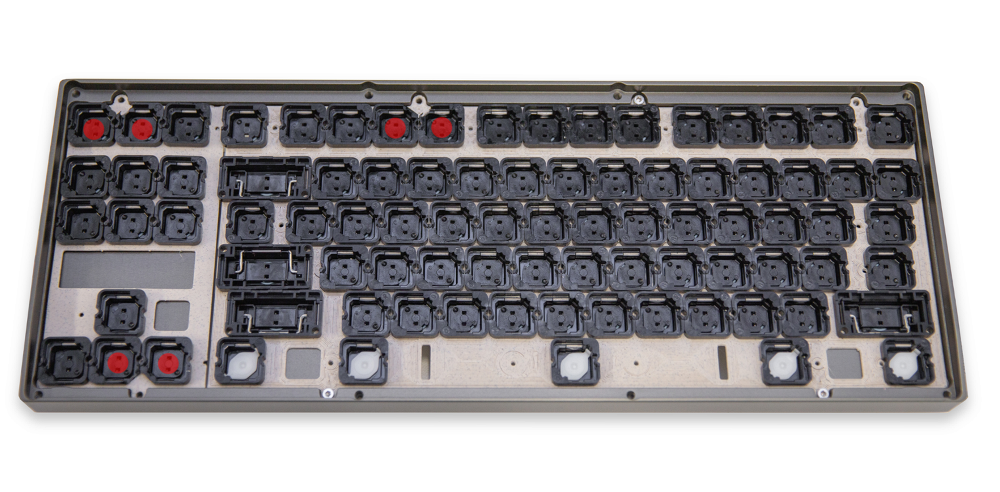

# EC Build Guide
**Drive Sizes**
1. 2.5 mm
2. 2 mm
3. 1.5 mm
## Disassembly
1. Place the assembled case face down on a soft, debris-free surface
2. Remove 8x case screws using a 2.5 mm driver, set aside at a safe place
3. Holding the case together with your hands, carefully flip the case to an upward facing orientation
4. Carefully lift off the top case, unplugging the JST wire if connected
5. Set bottom case aside
6. Remove 7x plate screws, if used, using a 2 mm driver and set aside at a safe  place
7. Carefully remove the plate and set aside
8. Disassembly finished!
## EC Assembly Preparation
There will be permanent modifications done to 6 Topre housings. The purpose of these cuts is to provide clearance for the gummy O-ring mounting tab used in MX builds.

-   Gather two housings and cut along the indicated red line using a scissor or flush cutter.
    -   Discard the corner when finished.
    -   Ensure that the cut is clean and the bottom of the housings remains flush.
    -   Repeat 2 additional times for a total of 6 modified housings.
## EC PCB-Plate Assembly
1. Place the top case, flower side down, on a flat surface, preferably elevated along the sides

2. With the plate screwed into the top part of the case,  snap Topre housings, 2u housings, and spacebar stabilizers into place on the plate. Snap stems into place if needed here as well
    -   Each pair of the modified housings are marked in red. Make sure that your modified housing matches the alignment in the provided photo.
3. Carefully place domes into housings.
    -   Due to the reduced spacing, it may be necessary to slightly trim the edges of the domes to prevent interference with surrounding strips.
4. Carefully add the sensing springs onto the dome
5. **CONNECT THE JST WIRE TO THE EC PCB AT THIS STEP AND THREAD IT THROUGH THE OPENING IN FRONT OF THE JST CONNECTOR**
6. Slowly place the EC PCB on the plate-housings-domes-springs assembly, such that the circle silkscreens are aligned to the springs
7. Tighten the assembly together using provided 8mm M2 flat head screws
	- Order isn't important but I prefer to start from the outside and then follow a clockwise pattern
## Case Assembly
1. Set the bottom case on a flat surface
	- ensure weight is flush with the bottom case, dampening could be affected if not
2. Remove daughterboard screws using a 1.5 mm driver
3. Carefully place the daughterboard into cutout
4. Screw the daughterboard into the case 
5. Attach the JST wire, that should already be connected to the PCB, to the daughterboard
9. Carefully slot top case to the bottom case
10. Hold the case together, flip the case, and place its sides along two raised edges. 
	- I used the two foam blocks included in the carrying case to keep the case elevated
11. Tighten the 8x case screws
12. Assembly finished!
## Flashing
1. Attach JST wire between PCB and daughterboard
3. Locate the two exposed pins on the back of the PCB

4. Open [QMK Toolbox](https://www.google.com/search?q=qmk+toolbox&rlz=1C1CHBF_enUS1049US1049&oq=qmk+toolbox&gs_lcrp=EgZjaHJvbWUyBggAEEUYOdIBCDE2MzNqMGo3qAIAsAIA&sourceid=chrome&ie=UTF-8)
5. Select appropriate firmware
6. Enable Auto-Flash
7. Short the two pins
8. Plug the keyboard into the PC
9. Allow the flashing process to finish
10. Test keys
## VIA Calibration
1. Open [VIA](https://www.caniusevia.com/)
2. Plug in keyboard
3. Load [eccalla.json](../../firmware/ec_via_definition/eccalla.json)
4. Open Configure/EC Tools
5. Calibrate or modify levels to your hearts content
- viewing output requires having QMK toolbox open on the side

For now we will be using draft definitions but I hope to have Calla added to the VIA repository in the near future.
